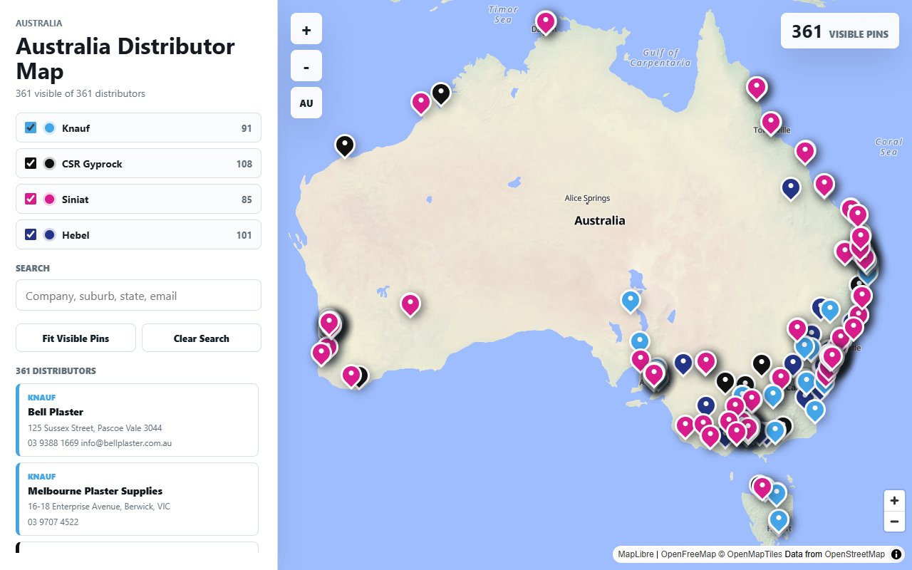
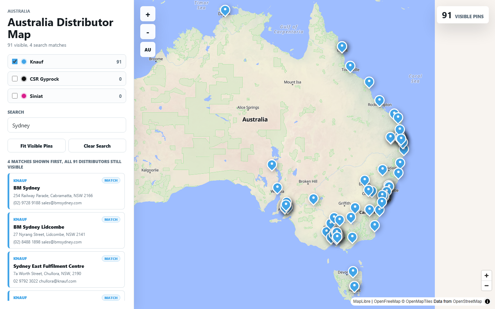

# Australia Distributor Map

Australia Distributor Map is a static browser app for exploring plasterboard distributor locations across Australia. It combines distributor data for Knauf, CSR Gyprock, Siniat, and Hebel into a searchable MapLibre map with supporting source outputs and workbook exports.

## Preview





## Map Features

- Filter the map by brand with the Knauf, CSR Gyprock, Siniat, and Hebel toggles.
- Show overlapping Hebel reseller locations as Hebel by default.
- Count every brand category a distributor belongs to, while using the primary brand only for the displayed pin and card color.
- Search by company, suburb, state, email, or other distributor text.
- See matching search results first while keeping the full filtered distributor list available.
- Use **Fit Visible Pins** to zoom the map around the current filtered set.
- Use **Clear Search** to return to the full selected brand view.
- Zoom with the map controls, or use **AU** to reset the map back to Australia.
- Select distributor cards in the sidebar to inspect company details, addresses, phone numbers, and emails.

## What Is Included

- `app/` - The map interface, styles, and bundled distributor dataset.
- `docs/images/` - Screenshots used in this README.
- `scripts/` - Data collection, preparation, workbook generation, and local serving utilities.
- `outputs/` - Generated JSON files, workbook exports, screenshots, and preview artifacts.

## Run The Map

```powershell
node scripts/serve_map_app.mjs
```

Then open `http://127.0.0.1:5173/`.

## Data

The map data is generated from the brand-specific source outputs and written to `app/data/distributors.json`. The generated workbooks and previews are kept in `outputs/` for review and sharing.

## Repository Notes

Local dependency folders, logs, environment files, Python caches, and deployment metadata are intentionally ignored.
